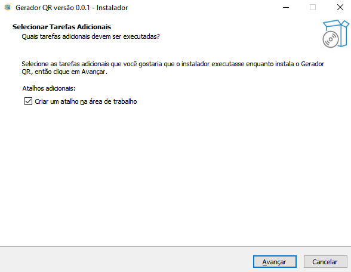
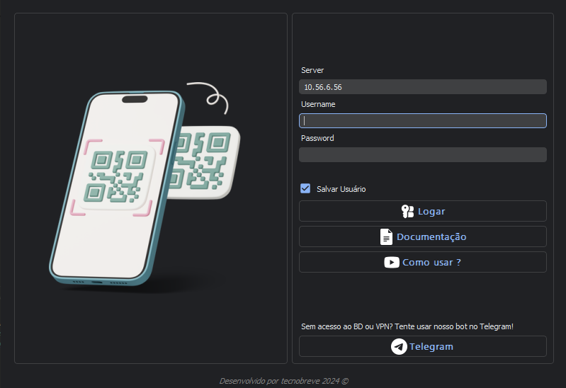
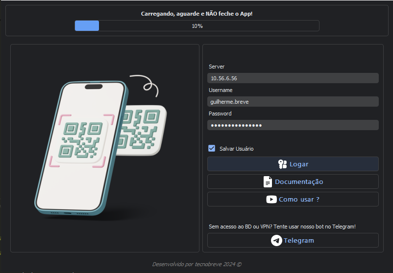
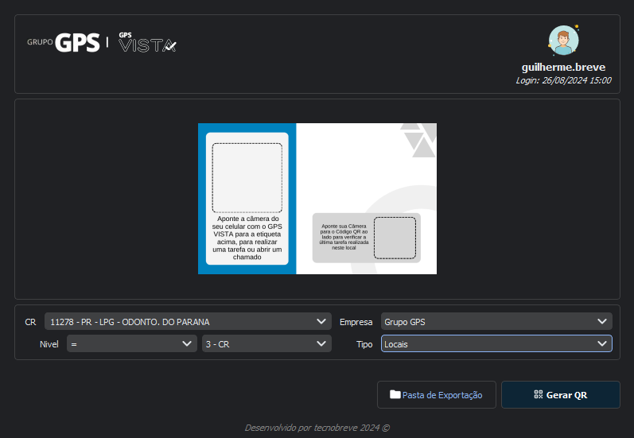
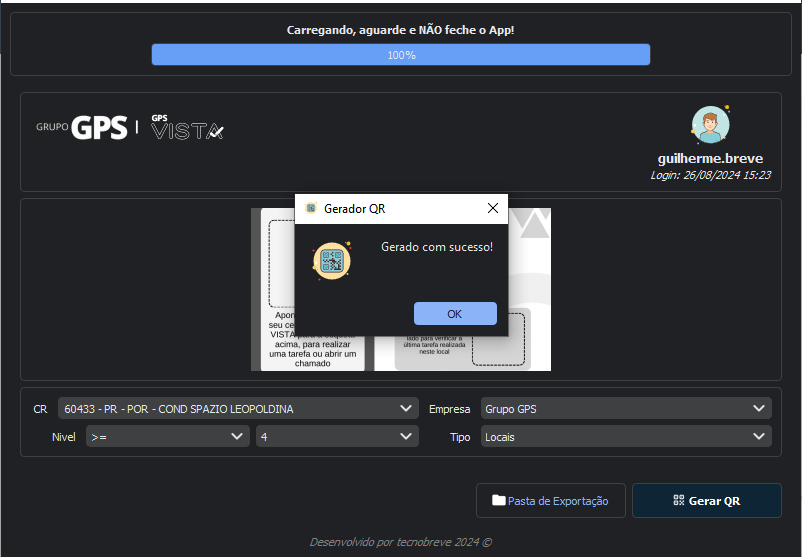
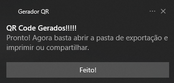
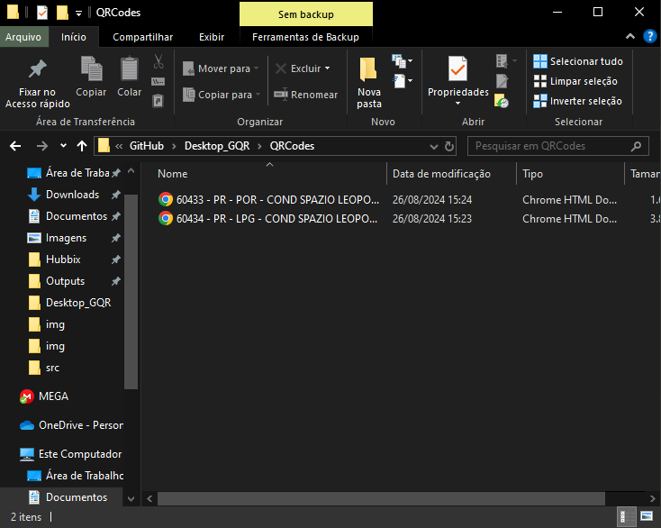
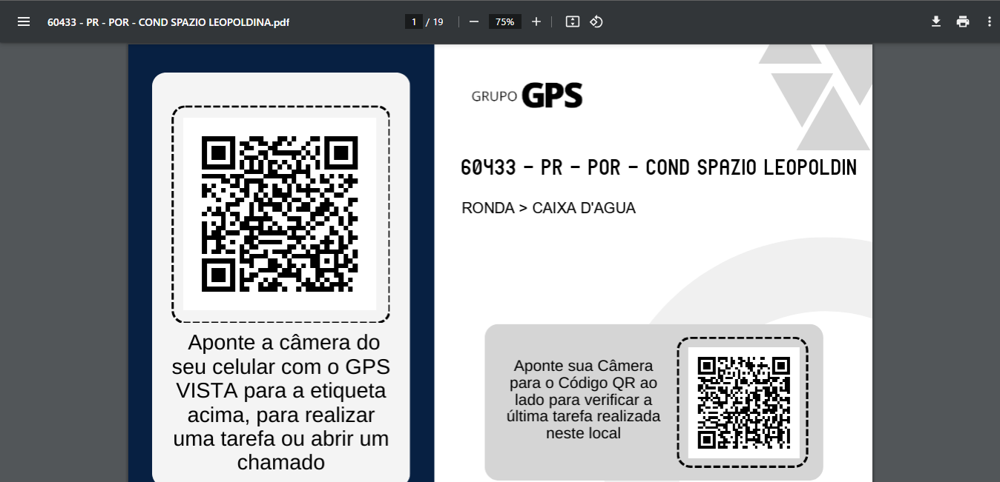
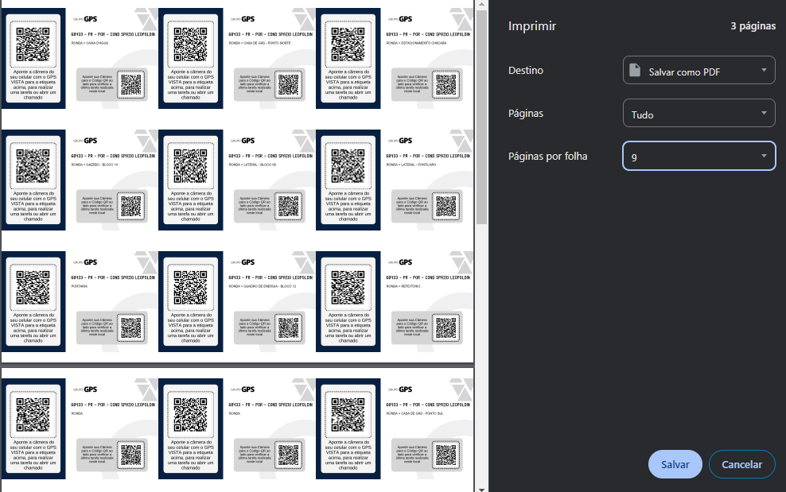

# Gerador QR

## Instalação
### Links

Para que seja realizado a instalação irei disponibilizar uma tabela abaixo, fique atento as atualizações pois elas serão frequentes!

> Por mais que o código seja aberto, ainda é indicado que baixe o instalador e execute em sua máquina !

| Sistema | Link para Download |
| ----------- | ----------- |
| Windows | [Mega](https://mega.nz/file/6EVkhDrB#j24MtE1VMZn-DS9yPCJmWxb1lIDEuNQvx1FD8xhkj48) |
| Linux | Na lista de afazeres. |
| Mac OS | Na lista de afazeres. |
| Android | Em desenvolvimento. |

Lembrando que é OBRIGATÓRIO o uso do VPN, caso nao tenha acesso nem ao VPN nem ao DB consulte seu superior!

### Como instalar

Será aberto uma caixa de texto simples, basta dar próximo e aguardar a instalação!

> Indico que execute como administrador pelo menos a primeira vez, caso não consiga, sem problemas !

Após a instalação ele será executado, caso não inicie automaticamente, faça manual!

## Login

Após iniciar, você irá notar que o servidor foi preenchido automáticamente, caso não seja o seu servidor, troque-o !

> Agora basta realizar seu login normalmente, com o acesso do Banco de Dados, você tem a opção de salvar este usuário para próximass conexões !

Caso você não tenha acesso, temos um bot no telegram, onde a geração não necessita de login!

> Telegram: [CNS Bot](https://t.me/gps_cns_bot)

Após inserir seus dados de login, o app irá começar a se conectar e realizar algumas consultas simples...
> Importante: Não feche o app, aguarde até que seja finalizado o login!

## Como gerar

Após logado, será aberto uma tela como essa!

 - Primeiro selecione o CR que deseja gerar os QR Codes!

 > Note que ao selecionar um CR em especifico a cor do Modelo acima modifica, isto é automatico!

 - Depois selecione o Nivel em que deseja que a consulta seja realizada!

        Exemplo: 
        Maior ou Igual Nivel 4 (>= 4)
        Somente o 3 - CR (= 3 - CR) 

 - Após isto, selecione a logo da empresa que ira aparecer em seu QR Final e se deseja diferenciar ativos de locais, abaixo de empresa!

Agora dar um "ENTER" ou clicar em "Gerar QR", e aguarde até que seja finalizado a confecção dos QRs, o app irá informar com uma caixa de mensagem e com uma notificação!

> Caixa de Mensagem do app:

> 

> Notificação:

> 

## Pasta de Exportação

Agora basta abrir a pasta de exportação clicando em "Pasta de Exportação" ou com o atalho "CTRL + O"

## PDF

Os QRCodes irão vir completos na página inteira, para separar basta clicar em **Imprimir ou salvar em PDF**

E em **Páginas por folha, coloquem o numero 9** ou o tamanho que preferir!

Pronto! :-)