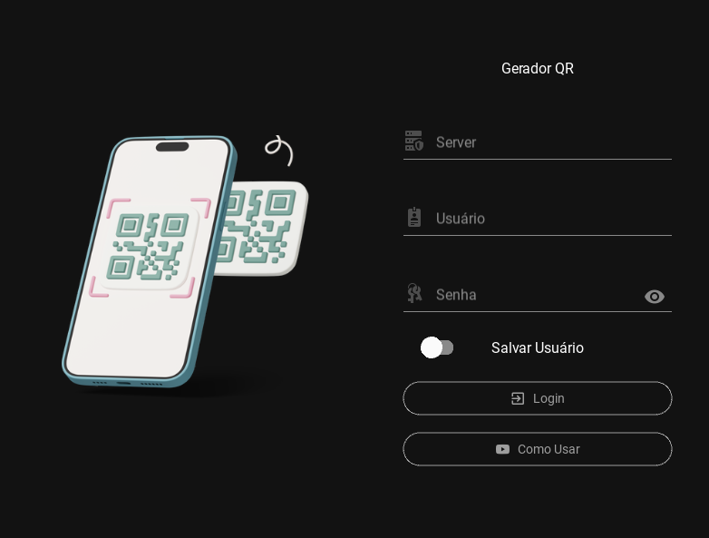
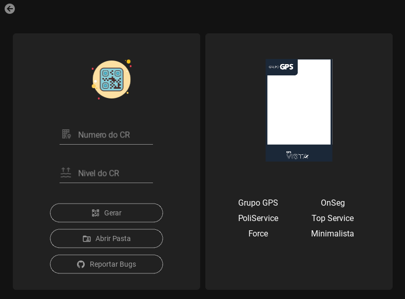
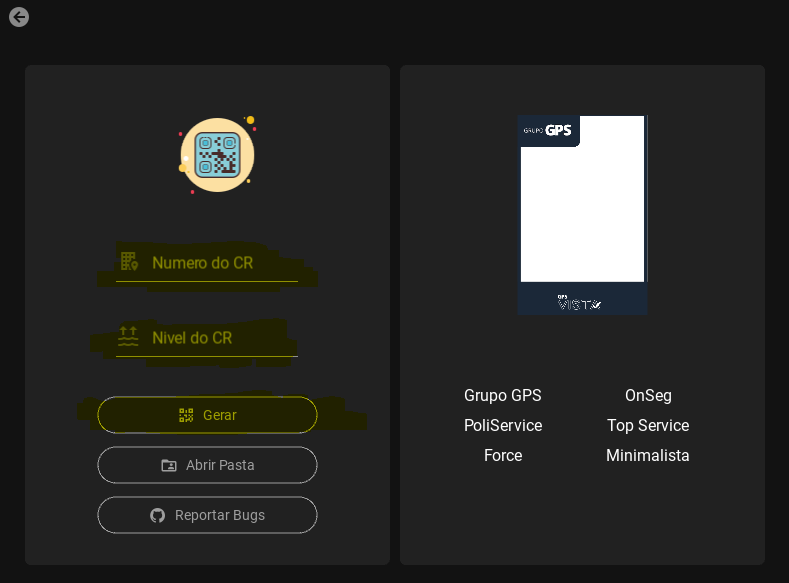
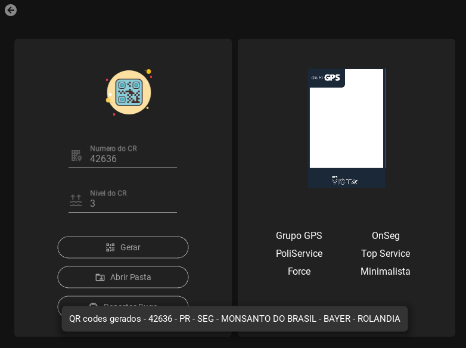
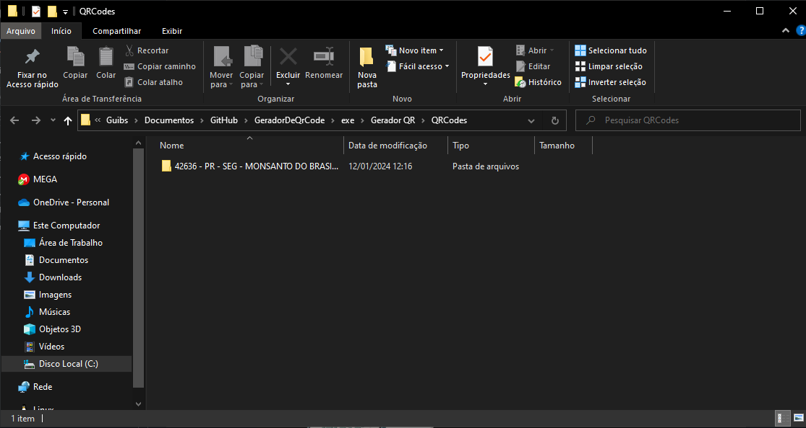
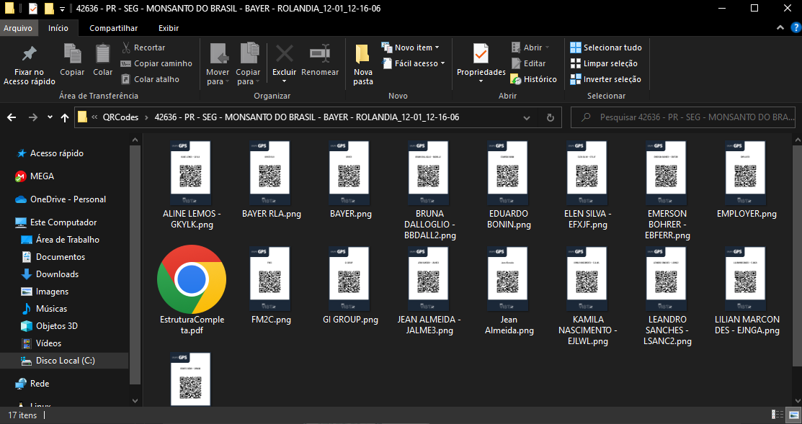
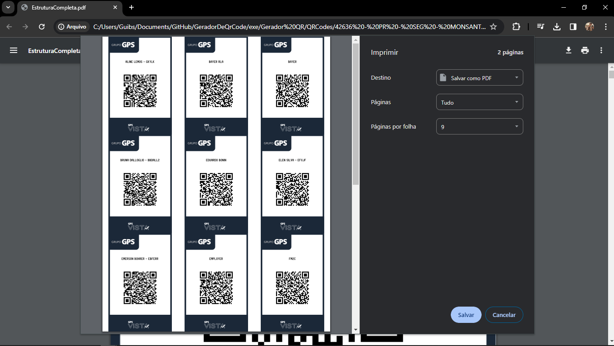

<h1>
  <b>
    Gerador QR - Grupo GPS
  </b>
</h1>
 
<h2>
  Versões
</h2>

  Android: <a href=''>Preview</a>

  Windows: <a href=''>Baixe Aqui</a>

  Linux: <a>Em breve</a>

 
<h2>
  Tela de Login
</h2>

  Aqui você realiza o login com suas credenciais do Banco de Dados!
   
  <b>Importante:</b> Esteja conectado ao OpenVPN, caso contrário o app pode não funcionar !!!

 

<h2>
  Tela Principal
</h2>

  Após logado, temos a tela principal!

 

Basta inserir os dados desejados, como CR(Somento os NUMEROS!) e Nivel do CR, caso n queira deixe em branco

 

Quando gerado o App te retorna, basta clicar em abrir pasta para ter acesso aos QRs

<h2>
  Explorer
</h2>
 

  Quando clicar em Abrir Pasta, o app te retorna a pasta raiz dos QRs

 

  Quando abrir a pasta deseja, vai encontrar os QRs tanto individuais(.png) quanto em arquivo unico(.pdf), ambos prontos pra impressão!!!

 

  Basta abrir o QR e imprimir ou enviar para a gráfica !

 

<h2>
  Versão Android
</h2>

Uma pre-release(Preview) para versão mobile, estamos desenvolvendo a parte logica!

