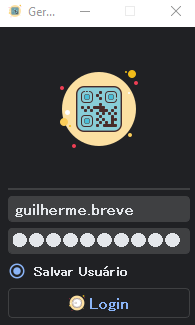

<image src= 'https://github.com/foxtec198/GeradorDeQrCode/assets/64221923/d1eae951-8619-42e5-8b74-af8563d4802b'>
 
<h1><b>Gerador Automatico de QRCodes</b></h1>

<h2> Tela de Login: </h2>

Aqui você irá realizar o Login no App com suas credenciais do BD

<h2>Tela Principal</h2>

Após realizar o login, você ira colocar um CR ou um Estrutura pra gerar os QRCodes

Botão para reporte de bugs // problemas adicionado

  

Adicionando a estrutura é só clicar em <b>Gerar</b>

<image src='https://github.com/foxtec198/GeradorDeQrCode/assets/64221923/202da2cd-968f-46c3-b5dd-f7ddcf055162'>

O app te retorna quando todos os QRCodes estiverem prontos!

<image src='https://github.com/foxtec198/GeradorDeQrCode/assets/64221923/568eab08-c6a0-45d5-bd43-8b24653bdb51'>

Após isso basta clicar em <b>Abrir Pasta</b>

  
  

<h2>Windows Explorer</h2>

Ele vai abrir o navegador de arquivos e seus QRCodes já estão disponiveis para uso!

<image src = 'https://github.com/foxtec198/GeradorQR/assets/64221923/798ec30b-3aec-4e32-a2ec-3c20b0a0b529'>
<h2>Finalizado:</h2>

Agora basta imprimir ou enviar a Gráfica.   Até mais!

<image src = 'https://github.com/foxtec198/GeradorQR/assets/64221923/d3331696-1f7d-449c-bfb6-83236dc10fd2'>
  
  

<b>Novidade:</b>Nova geração de PDF com todos os QR Codes Prontos pra impressão

<image src = 'resources/prints/explorer.png'>
<image src= 'resources/prints/pdf.png'>

